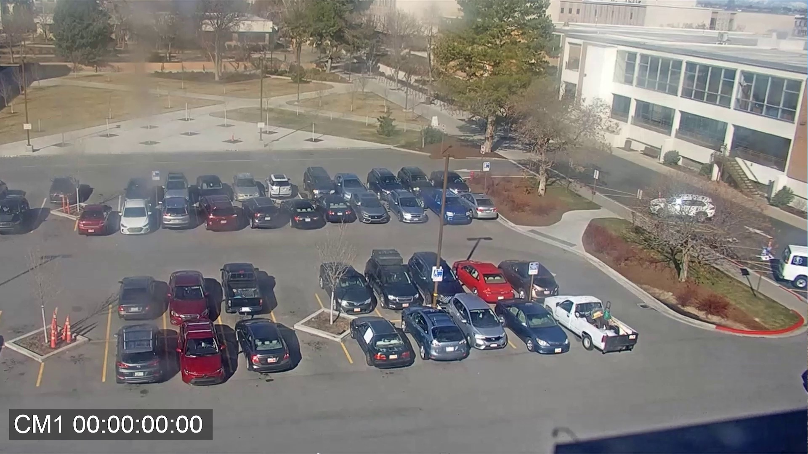
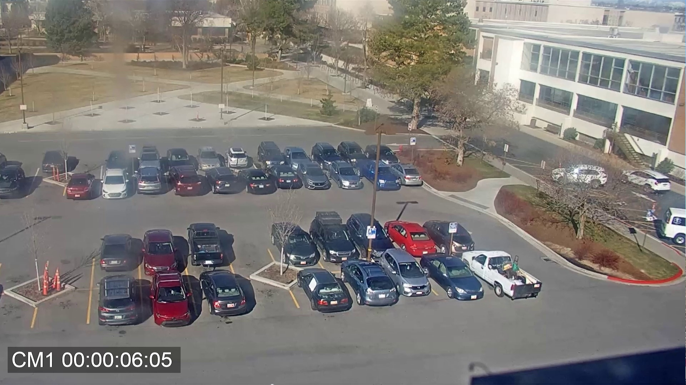
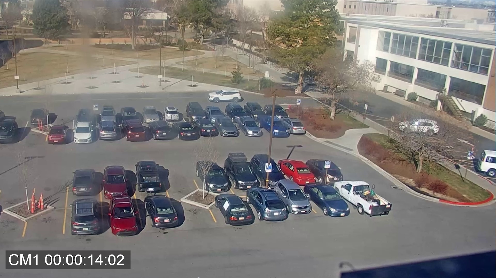
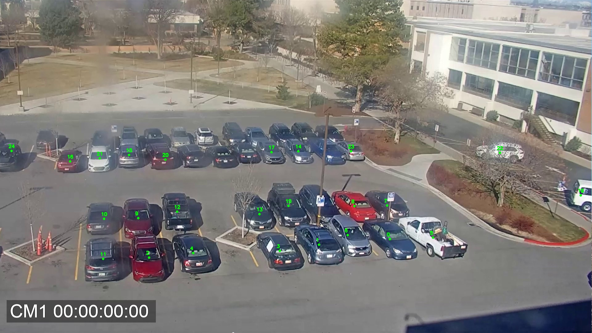
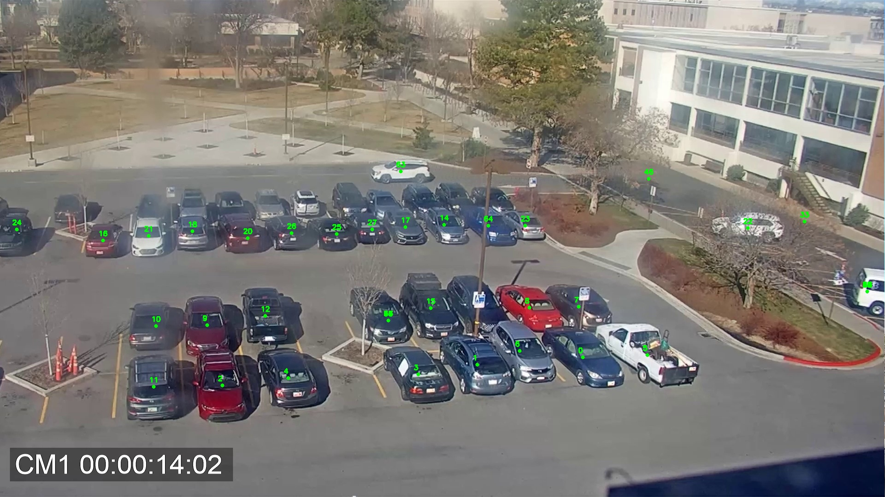
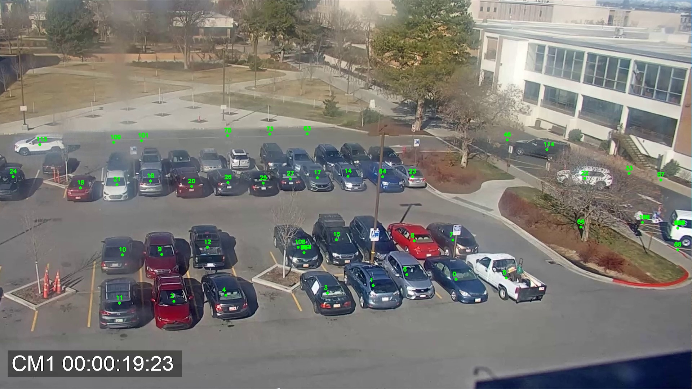

# Parking Spot Tracking

This project implements a parking spot tracking system using centroid tracking with Euclidean distance and YOLOv9 object detection. It allows for the extraction of frames from an overhead CCTV video, performs object detection on each frame to detect vehicles, and tracks their centroids across frames.

## Folder Structure

```
parking-spot-tracking
├── data
│ ├── output_video.mp4
│ └── overhead_cctv_video.mp4
├── frames
│ ├── frame_1.jpg
│ └── frame_2.jpg
├── detections
│ ├── frame_1.jpg
│ └── frame_1.json
├── centroid_tracker.py
├── extractFrames.py
├── README.md
├── requirements.txt
└── yolov9c.pt
```

## Usage

1. **Clone Repository:**
    ```bash
    git clone https://github.com/noman024/parking-spot-tracking.git
    cd parking-spot-tracking
    ```

2. **Install Dependencies:**
    ```bash
    pip install -r requirements.txt
    ```

3. **Run the Script:**
    ```bash
    python extractFrames.py
    ```

4. **View Results:**
    - Extracted frames will be saved in the `frames` directory.
    - Detected vehicles in frames and their information will be saved in the `detections` directory.
    - Output video with combined detection frames will be saved in the `data` directory.

## Extracted Frames

 




## Detected Vehicles






## Output Video

You can view or download the output video from the following link:

[Output Video](https://drive.google.com/drive/folders/1KHWmQFzBMLLaRbD0ROsyWiYAF_-E3W9K)

## Creating Output Video

To create the output video by combining the detected frames, you can use the following Python code snippet:

```python
import cv2
import os

def create_video_from_images(image_folder, output_path, output_fps=5):
    # Get the list of image files
    image_files = [os.path.join(image_folder, img) for img in os.listdir(image_folder) if img.endswith(".jpg")]

    # Sort the image files by filename
    image_files.sort()

    # Get the dimensions of the first image
    img = cv2.imread(image_files[0])
    height, width, _ = img.shape

    # Define the video codec and create a VideoWriter object
    fourcc = cv2.VideoWriter_fourcc(*'XVID')
    video_writer = cv2.VideoWriter(output_path, fourcc, output_fps, (width, height))

    # Write each image to the video
    for image_file in image_files:
        img = cv2.imread(image_file)
        video_writer.write(img)

    # Release the VideoWriter object
    video_writer.release()

# Define the input image folder and output video path
image_folder = "/home/noman/parking-spot-tracking/detections"
output_path = "/home/noman/parking-spot-tracking/data/output_video.mp4"

# Create the video from images
create_video_from_images(image_folder, output_path)
```

## Requirements

- Python >= 3.8
- OpenCV
- PyTorch
- Ultralytics
- Matplotlib
- NumPy

## Feel Free to Contribute

If you find this useful, please consider forking the repository, giving it a star, or contributing in any other way you see fit. Your support is greatly appreciated!
